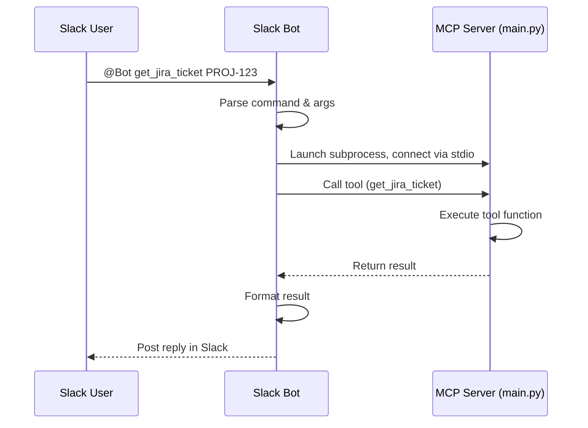
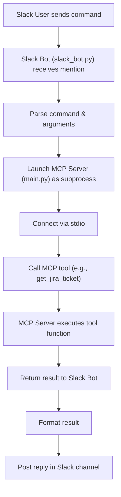

# Project Structure & Workflow Overview

## Directory Layout

```
jira-slack-mcp/
  ├── main.py           # MCP server: exposes tools for Jira/Confluence
  ├── slack_bot.py      # Slack bot: connects Slack to MCP tools
  ├── requirements.txt  # Python dependencies
  └── README.md         # Project documentation
```

---

## Workflow Overview

### 1. Slack User Interaction
- A user sends a message in Slack, mentioning your bot and a command (e.g., `@Atlassian MCP Bot get_jira_ticket PROJ-123`).

### 2. Slack Bot Receives the Command
- `slack_bot.py` is running and listens for mentions using the Slack Bolt framework.
- When mentioned, it parses the command and arguments from the message.

### 3. Slack Bot Calls the MCP Server
- The bot launches the MCP server by running `main.py` as a subprocess (using `StdioServerParameters`).
- It connects to the MCP server using standard input/output streams.

### 4. MCP Server (main.py)
- `main.py` exposes a set of tools (functions) for Jira and Confluence, such as:
  - `get_jira_ticket`
  - `create_jira_ticket`
  - `search_jira_tickets`
  - `search_confluence_pages`
- These tools can operate in **mock mode** (no credentials) or **live mode** (with real Atlassian credentials from `.env`).

### 5. Tool Execution
- The Slack bot sends a tool call request (e.g., `get_jira_ticket` with `ticket_id=PROJ-123`) to the MCP server.
- The MCP server executes the corresponding function and returns the result (as a Python dict, usually).

### 6. Slack Bot Formats and Sends the Result
- The bot receives the result from the MCP server.
- It formats the result (as plain text or JSON) and posts it back to the Slack channel as a reply.

---

## Key Technologies Used

- **Slack Bolt**: For Slack bot event handling.
- **MCP (Model Context Protocol)**: For tool calling and server-client communication.
- **Python**: For both the bot and the MCP server.
- **requests**: For making HTTP requests to Jira/Confluence APIs.
- **dotenv**: For loading credentials from `.env`.

---

## Modes of Operation

- **Mock Mode**: If `.env` is missing or incomplete, tools return hardcoded/sample data for safe testing.
- **Live Mode**: If `.env` is set up with Atlassian credentials, tools interact with real Jira/Confluence APIs.

---

## Typical Flow Example

1. **User:** `@Atlassian MCP Bot get_jira_ticket PROJ-123`
2. **Bot:** Parses command → launches MCP server → calls `get_jira_ticket` tool.
3. **MCP Server:** Runs `get_jira_ticket("PROJ-123")` → returns ticket info.
4. **Bot:** Receives result → formats it → posts back to Slack.

---

## Extending the System

- **Add new tools:** Define new functions in `main.py` and register them as MCP tools.
- **Improve Slack formatting:** Update the message formatting logic in `slack_bot.py`.
- **Add error handling:** Enhance both bot and server for better user feedback. 

---

## Visual Workflow Diagrams

### Sequence Diagram



### Flowchart Diagram

